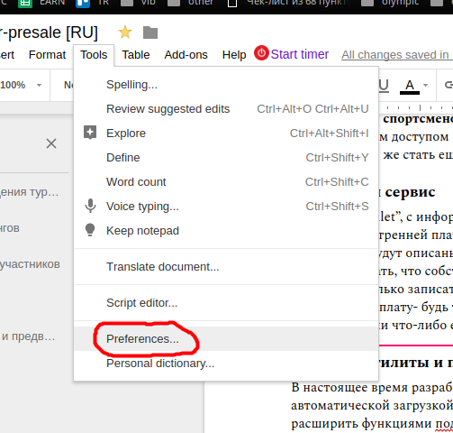

# Google Docs Tips

Google Docs could help you to write texts better. Just use these simple tips and
advices.

## Set up autoreplace

In main menu choose `Tools > Preferences…`

Then enable `Automatic substitution`, and add the following pairs:

* `---` -> ` — ` // long dash with non-break spaces around
* `(r)` -> `®`
* `(c)` -> `©`
* `(v)` -> `Ⓥ` // Volebo Coin symbol
